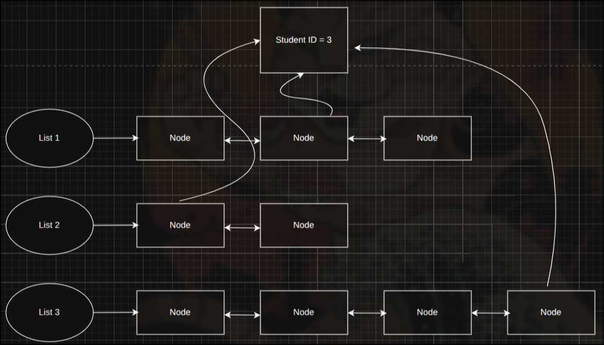
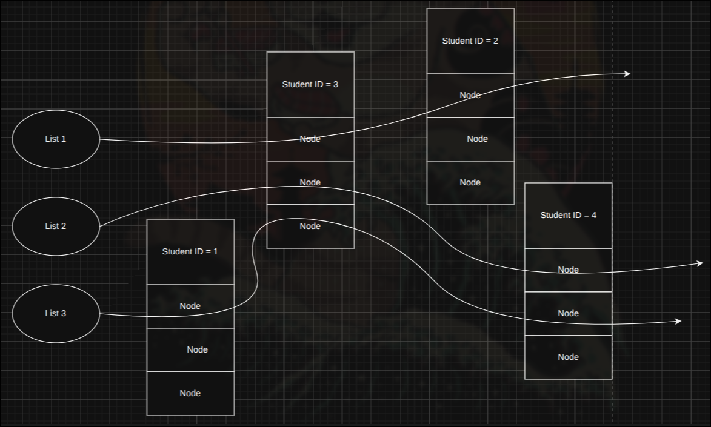

# Glue base doubly linked list

Glue base doubly linked list, stick linked list node with the struct. If you need to maintain multiple linked lists and need to remove the struct, it will speed up your operation than a regular node that stores data as a pointer.

For example, you maintain 3 linked lists and need to remove the struct student with id = 3. In a regular linked list, you need to find the node that points to the struct student with id = 3 for each list. remove each associated node, then free the student struct. But for glue glue-based doubly linked list, you can just find the struct in just one list, then the rest can be removed in O(1).

## Regular linked list


## Glue-based linked list


## Usage
```c
#include "glthread.h"
#include <stdlib.h>
#include <stdio.h>
#include <memory.h>

typedef struct emp_ {
    char name[30];
    unsigned int salary;
    char designation[30];
    unsigned int emp_id;
    glthread_node_t glnode;
} emp_t; 

void
print_emp_details(emp_t *emp){
    printf("Employee name = %s\n", emp->name);
    printf("salary = %u\n", emp->salary);
    printf("designation = %s\n", emp->designation);
    printf("emp_id = %u\n", emp->emp_id);
}

int 
main(int argc, char **argv){

    emp_t *emp1  = calloc(1, sizeof(emp_t));
    strncpy(emp1->name, "Neha", strlen("Neha"));
    emp1->salary = 50000;
    strncpy(emp1->designation, "HR", strlen("HR"));
    emp1->emp_id = 21;
    glthread_node_init((&emp1->glnode));

    emp_t *emp2  = calloc(1, sizeof(emp_t));
    strncpy(emp2->name, "Abhishek", strlen("Abhishek"));
    emp1->salary = 150000;
    strncpy(emp2->designation, "SE3", strlen("SE3"));
    emp2->emp_id = 32;
    glthread_node_init((&emp2->glnode));

    emp_t *emp3  = calloc(1, sizeof(emp_t));
    strncpy(emp3->name, "Arun", strlen("Arun"));
    emp3->salary = 60000;
    strncpy(emp3->designation, "SE4", strlen("SE4"));
    emp3->emp_id = 27;
    glthread_node_init((&emp3->glnode));


    /*Now Create a glthread*/
    glthread_t *emp_list = calloc(1, sizeof(glthread_t));
    glthread_init(emp_list, offsetof(emp_t, glnode));

    /*Now insert the records in glthread*/
    printf("size=%d\n", emp_list->size);
    glthread_add(emp_list, &emp1->glnode);
    printf("size=%d\n", emp_list->size);
    glthread_add(emp_list, &emp2->glnode);
    printf("size=%d\n", emp_list->size);
    glthread_add(emp_list, &emp3->glnode);
    printf("size=%d\n", emp_list->size);


    /*Walk over glthread*/
    emp_t *ptr = NULL;
    ITERATE_GL_THREADS_BEGIN(emp_list, emp_t, ptr){

        print_emp_details(ptr);
    } ITERATE_GL_THREADS_ENDS;

    /*Let us remove one record at random*/

    glthread_remove(emp_list, &emp2->glnode);
    printf("size=%d\n", emp_list->size);
    printf("\nprinting again . . . \n");

    ITERATE_GL_THREADS_BEGIN(emp_list, emp_t, ptr){

        print_emp_details(ptr);
    } ITERATE_GL_THREADS_ENDS;


    /*Free all Dynamicall allocations*/
    while (emp_list->size) {
         ptr = tostruct(emp_t, emp_list, glthread_remove(emp_list, NULL));
         free(ptr);
    }
    glthread_destroy(emp_list);
    #if 0
    ITERATE_GL_THREADS_BEGIN(emp_list, emp_t, ptr){
        
         glthread_remove(emp_list, &ptr->glnode);
         free(ptr);
    } ITERATE_GL_THREADS_ENDS;
    #endif

    return 0;
}
```
